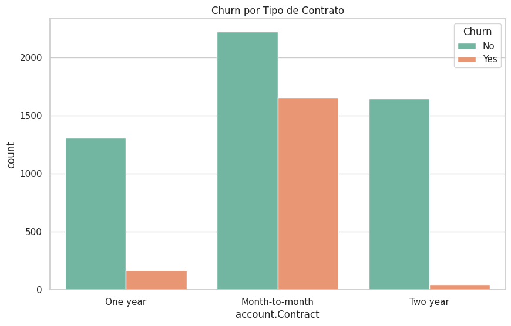
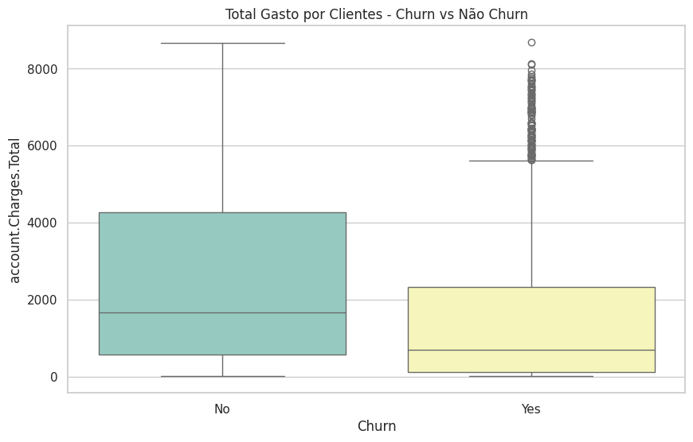
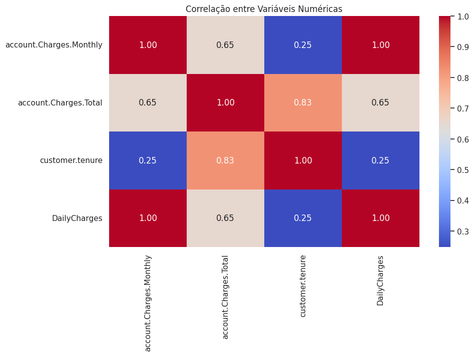

# 📊 Telecom X - Análise de Evasão de Clientes 📉

Projeto educacional desenvolvido como parte da formação **ONE – Tech Fundation – Especialização em Data Science**, promovida pela **Alura** em parceria com a **Oracle**.  
O objetivo principal é analisar os dados de uma operadora fictícia de telecomunicações para identificar padrões que indicam a **evasão de clientes** (churn) e propor insights que ajudem na retenção.
O desafio Telecom X oferece uma oportunidade única para aplicar habilidades essenciais de análise de dados em um cenário de negócios real.

## 🔍 Objetivo

Analisar o comportamento de clientes da empresa fictícia **Telecom X** para identificar padrões de **evasão (churn)** e apoiar estratégias de retenção.

## 📁 Estrutura do Projeto
````
Telecom-X/
│
├── telecom_x_analysis.ipynb       # Notebook principal com toda a análise
├── dataset/
│   └── telecom_customer_churn.csv # Base de dados usada no projeto
├── images/                        # Pasta opcional com gráficos e visualizações
│   └── churn_distribution.png
│   └── correlation_matrix.png
└── README.md                      # Este arquivo
````

## 🚀 Tecnologias utilizadas

- Python 3.x  
- Google Colab  
- Pandas  
- Matplotlib & Seaborn  
- Scikit-learn  
- Jupyter Notebook (via Colab)  
- Markdown
- Git/GitHub

## ▶️ Como executar o notebook

1. Acesse o notebook no [Google Colab](https://colab.research.google.com/) ou clone o repositório: git clone https://github.com/opusvix/Telecom-X.git
2. Acesso o notebook no Google Colab ou ambiente Jupyter.
3. Instale as dependências, se necessário.

## 📊 Etapas do Projeto

1. **Coleta e compreensão dos dados**
2. **Limpeza e tratamento**
3. **Análise exploratória**
4. **Modelagem preditiva**
5. **Conclusões e recomendações**

## 📌 Insights

- Identificação de variáveis com maior impacto na evasão.
- Perfil de clientes com maior propensão ao churn.
- Sugestões de ações para retenção de clientes.

## 🖼️ Prints dos gráficos (exemplos)

### 📈 Gráfico: Distribuição de Churn por Contrato



### 📈 Gráfico: Total Gasto por Clientes



### 📈 Gráfico: Distribuição de Evasão de Clientes


### 📈 Gráfico: Correlação entre Variáveis Numéricas



## 🧠 Autor

Desenvolvido por Maurício Barros

Especialista em Análise de Dados com interesse em IA Generativa.
